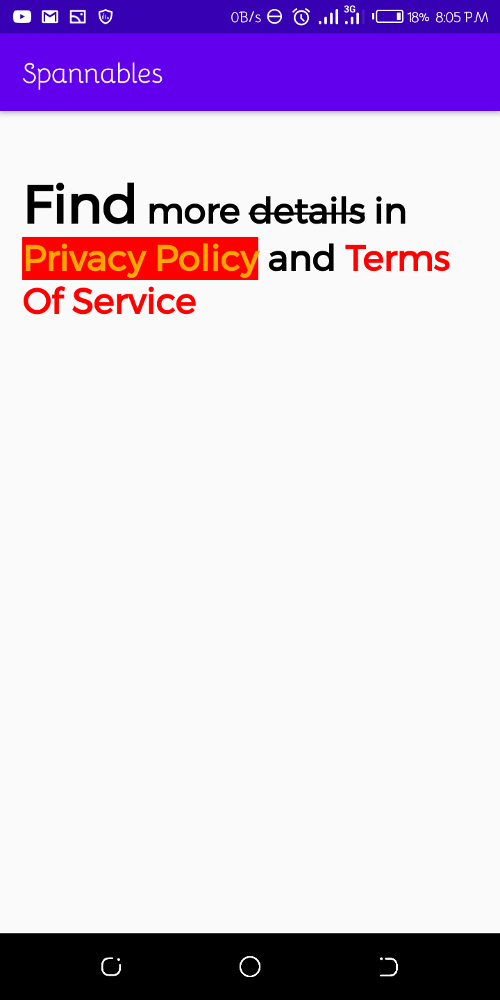

# Using Spannables

Whew!. Most object-oriented programming languages provide us with an amazing data structure almost all (if not all) developers are familiar with - *String*. The *String* data structure allows us to conveniently compose a set of characters into a single structure, and perform various operations on it.

**That sounds good, and probably was not needed at all, but why not?.**

In Android development, the *String* type is used everywhere, most data reperesented on UI screens are converted to *String* format to be used easily. While this solves most of the "UI" tasks we face on a day to day, it does not really help when it comes to segmenting parts of the *Strings* and making design changes to them. You might argue, that we can always append *TextViews* to other *TextViews* and style them independently, but in no time would your layout look obscure and disorganised, as we would have to keep track of various texts and their styles, which is not what we want.

So, how do we solve this? - **Spannables**

Well, similar to the `span` element in `HTML`, **Spannables** allow android developers to seperate various parts of a single text and apply independent styles to them, to make them standout.

There are three types of **Spannables** actually:

1. `SpannedString`: This takes in the *String* whose parts are to be styled, but does not allow modifications to the string text nor does it allow alterations to the original styles given to certain parts of the string.

2. `SpannableString`: This takes in the *String* whose parts are to be styled, but does not allow modifications to the string text but it does allow alterations to the original styles given to certain parts of the string.

3. `SpannableStringBuilder`: This takes in the *String* whose parts are to be styled, but it allows modifications to the string text (text can be appended, inserted or removed from the original) and it allows alterations to the original styles given to certain parts of the string.

It is very useful, but in this project I came up with the design below, in a single text. As time goes on, and more research is conducted, this would be updated with different designs I try out.

